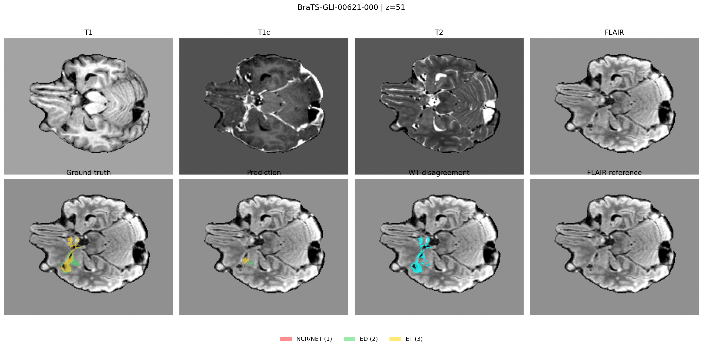
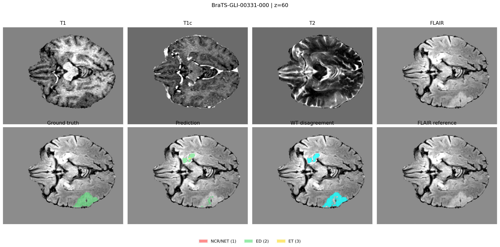
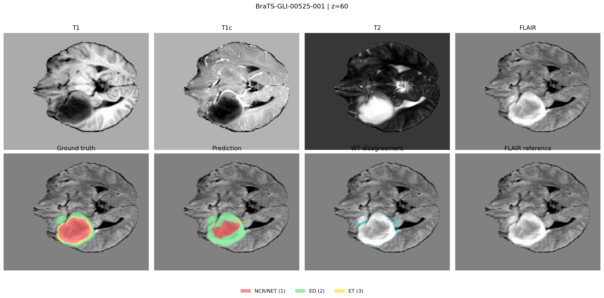
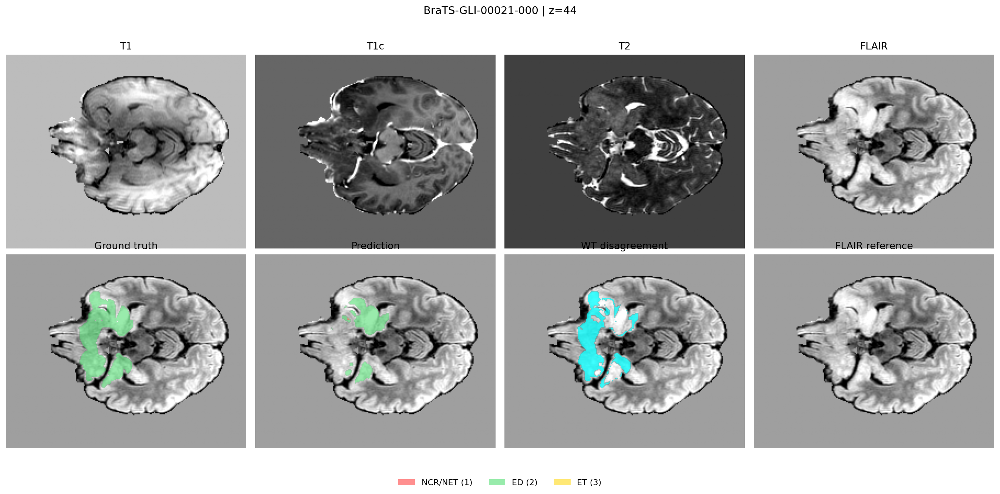
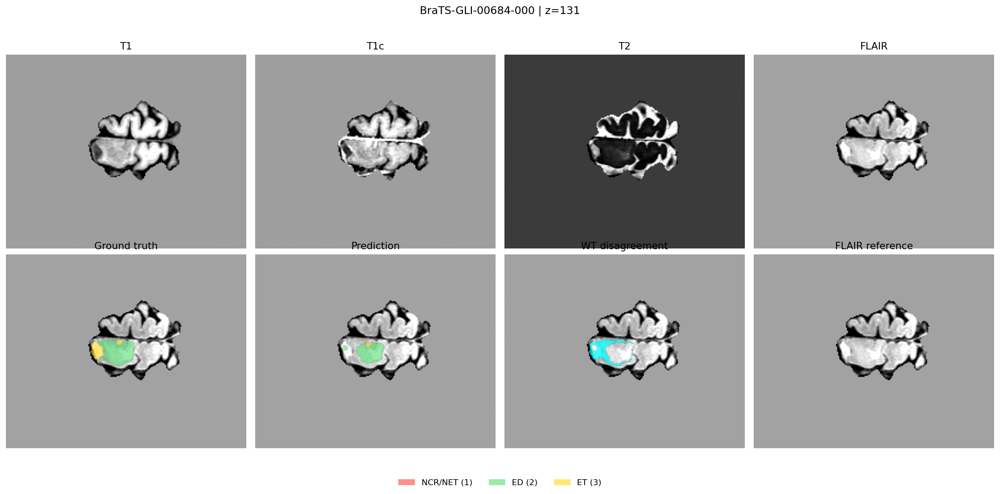
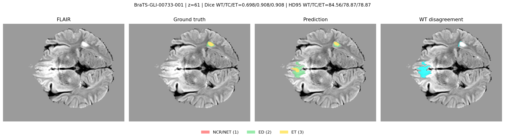
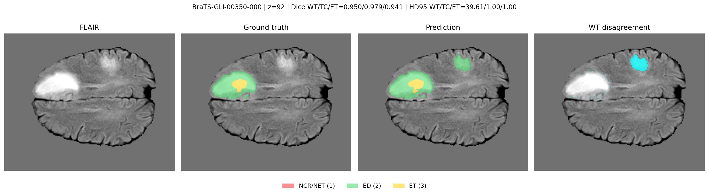

# TAF-TransBTS A3 Bad-Case Analysis

## 1. Scope

This analysis uses the final TAF-TransBTS A3 checkpoint:

`outputs/taf_transbts_cluster_a3_finetune_resume_mmap/checkpoints/best.ckpt`

The checkpoint was selected at epoch `150`. Full-volume sliding-window inference was run on all
`127` test cases with patch size `96 x 96 x 96` and stride `48`.

The analysis is descriptive. Any post-processing threshold or architecture change motivated by
these observations must be selected on the validation split, not on the test split.

## 2. Overall Paired Comparison Against TransBTS

| Metric | TransBTS baseline | TAF-TransBTS A3 | Delta |
| --- | ---: | ---: | ---: |
| WT Dice | 0.9132 | 0.9160 | +0.0028 |
| TC Dice | 0.9022 | 0.9087 | +0.0065 |
| ET Dice | 0.8711 | 0.8774 | +0.0063 |
| Mean Dice | 0.8955 | 0.9007 | +0.0052 |
| WT HD95 | 4.91 | 5.41 | +0.50 |
| TC HD95 | 3.26 | 3.73 | +0.47 |
| ET HD95 | 3.62 | 3.49 | -0.14 |

TAF improves Mean Dice in `82 / 127` cases and regresses in `45 / 127` cases. The average Dice
gain is therefore not caused by one isolated outlier. However, WT and TC HD95 become slightly
worse. In `16` cases, WT Dice improves while WT HD95 regresses. This pattern is consistent with
small disconnected false-positive regions or a small number of distant boundary errors.

No case has infinite WT, TC, or ET HD95. There is no systematic complete-collapse problem in
the final checkpoint.

## 3. Five Lowest Mean-Dice Cases

| Case | WT Dice | TC Dice | ET Dice | Mean Dice | Main failure mode |
| --- | ---: | ---: | ---: | ---: | --- |
| `BraTS-GLI-00621-000` | 0.752 | 0.141 | 0.141 | 0.345 | Severe TC/ET under-segmentation for a thin, anatomically complex enhancing region |
| `BraTS-GLI-00331-000` | 0.443 | 0.214 | 0.438 | 0.365 | Low-contrast diffuse WT under-segmentation with fragmented prediction and distant false positives |
| `BraTS-GLI-00525-001` | 0.975 | 0.387 | 0.098 | 0.486 | WT is accurate, but the thin enhancing rim and tumor core are strongly under-segmented |
| `BraTS-GLI-00021-000` | 0.744 | 0.364 | 0.424 | 0.511 | Diffuse, irregular edema boundary is under-segmented; prediction is fragmented |
| `BraTS-GLI-00684-000` | 0.760 | 0.465 | 0.465 | 0.563 | Small peripheral lesion with TC/ET under-segmentation and boundary uncertainty |

### 3.1 `BraTS-GLI-00621-000`

The model captures much of WT but predicts only a compact part of TC/ET. The ground truth
contains a thin, branching enhancing structure. Relative to baseline, WT Dice improves by
`+0.015`, while TC and ET Dice both regress by `-0.147`. This is a small-structure continuity
problem rather than a global localization failure.

### 3.2 `BraTS-GLI-00331-000`

The posterior-inferior WT region has weak and diffuse contrast. TAF predicts only a fragmented
subset and introduces distant false-positive regions. The WT prediction contains `12`
connected components and `1235` voxels outside the largest component. WT HD95 increases from
`6.78` for baseline to `63.65` for TAF.

### 3.3 `BraTS-GLI-00525-001`

WT segmentation is strong (`0.975` Dice), but TC and ET are underestimated. ET contains a thin
enhancing rim around a large lesion. The model predicts only `1481` ET voxels for `12841`
ground-truth ET voxels. This case indicates that WT improvement alone does not guarantee
clinically adequate fine-region segmentation.

### 3.4 `BraTS-GLI-00021-000`

The edema region is diffuse and irregular. TAF misses large WT portions and produces
fragmentation: `22` predicted WT components with `2978` voxels outside the largest component.
No obvious acquisition artifact is visible in the inspected slice. Low contrast and complex
boundary shape are more plausible explanations.

### 3.5 `BraTS-GLI-00684-000`

This is a relatively small peripheral lesion. The model captures most WT but under-segments
TC/ET. Relative to baseline, TC Dice decreases by `-0.175` and ET Dice decreases by `-0.108`.
The likely issue is limited small-region evidence rather than a large localization error.

## 4. HD95 Outliers

Mean Dice alone hides clinically relevant boundary failures.

| Case | WT Dice | WT HD95 | Connected-component evidence | Interpretation |
| --- | ---: | ---: | --- | --- |
| `BraTS-GLI-00733-001` | 0.698 | 84.56 | `30` WT components; `4848` voxels outside the largest WT component | Distant false positives dominate HD95 |
| `BraTS-GLI-00331-000` | 0.443 | 63.65 | `12` WT components; `1235` non-main WT voxels | Combined under-segmentation and false positives |
| `BraTS-GLI-00555-000` | 0.652 | 41.34 | WT is substantially under-segmented | Boundary and coverage failure |
| `BraTS-GLI-00656-000` | 0.948 | 40.40 | High WT Dice but distant errors remain | HD95 reveals errors hidden by overlap score |
| `BraTS-GLI-00350-000` | 0.950 | 39.61 | `3` WT components; `4256` non-main WT voxels | Main tumor is accurate, but a distant WT component remains |

Two representative examples:

`BraTS-GLI-00350-000` is particularly informative: Mean Dice is `0.9564`, but WT HD95 is
`39.61`. This is exactly why Dice and HD95 must both be reported.

## 5. Cases Improved by TAF

TAF is not merely shifting errors. It substantially repairs several difficult cases:

| Case | Baseline Mean Dice | TAF Mean Dice | Delta |
| --- | ---: | ---: | ---: |
| `BraTS-GLI-00525-000` | 0.697 | 0.886 | +0.189 |
| `BraTS-GLI-00321-000` | 0.435 | 0.616 | +0.181 |
| `BraTS-GLI-00116-000` | 0.480 | 0.637 | +0.157 |
| `BraTS-GLI-00113-000` | 0.603 | 0.731 | +0.128 |
| `BraTS-GLI-00485-000` | 0.657 | 0.725 | +0.068 |

The strongest gains are concentrated in TC and ET for several cases, which is consistent with
the intended benefit of controlled modality-specific fusion.

## 6. Recommended Next Experiments

### 6.1 Validate connected-component post-processing on the validation split

The first experiment should remove only small disconnected components and compare Dice and
HD95 before and after post-processing on the validation split. Do not blindly retain only the
single largest WT component: some ground-truth masks are genuinely multi-component.

A conservative validation sweep could test:

- remove non-main WT components smaller than `50`, `100`, `250`, and `500` voxels;
- retain components close to a larger component;
- preserve TC/ET components only when they remain nested inside retained WT.

This directly targets the HD95 issue without changing the trained model.

### 6.2 Add Gaussian weighting for sliding-window overlap

The current inference path averages overlapping patch logits uniformly. Gaussian center
weighting is worth evaluating on the validation split because it may reduce patch-edge
artifacts and fragmented predictions.

### 6.3 Address TC/ET under-segmentation separately

The lowest-Dice cases show a second problem that component filtering cannot fix: thin and small
TC/ET regions are missed. A narrowly scoped loss ablation is appropriate:

- slightly increase TC/ET emphasis;
- consider a small boundary or surface-loss term;
- inspect whether ET-focused patch sampling improves thin enhancing rims.

Only one change should be introduced per experiment.

### 6.4 Do not attribute failure primarily to acquisition artifacts

The inspected multimodal slices do not show clear evidence that artifacts are the dominant
cause of the five worst cases. The stronger evidence supports low contrast, small or thin
lesions, complex boundaries, and disconnected false positives.

## 7. Generated Evidence

- `analysis_summary_test.json`: overall TAF bad-case summary.
- `per_case_metrics_test.csv`: all `127` TAF per-case metrics.
- `worst_cases_test.csv`: combined worst Mean-Dice and WT-HD95 cases.
- `worst_case_figures_test/`: `17` FLAIR-overlay worst-case figures.
- `multimodal_badcase_figures_test/`: four-modality figures for the five lowest Mean-Dice cases.
- `selected_component_metrics_test.csv`: connected-component statistics for selected cases.
- `vs_transbts_baseline/paired_case_metrics_test.csv`: all `127` paired baseline-versus-TAF rows.
- `vs_transbts_baseline/paired_analysis_summary_test.json`: paired aggregate summary.
